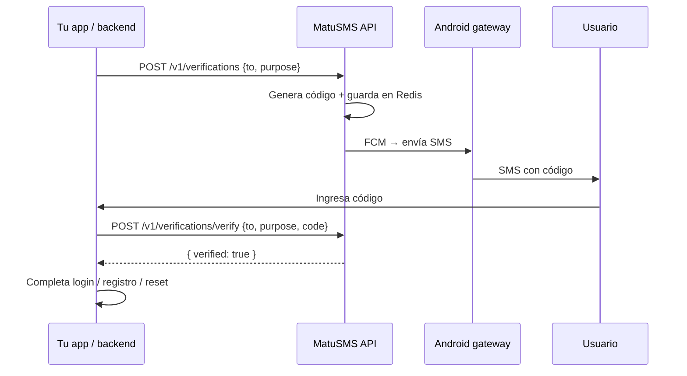

# MatuSMS API SaaS — Mensajes transaccionales y OTP

Guía para integrar MatuSMS en tu aplicación (web, mobile o backend) y enviar SMS transaccionales: confirmación de login, registro con código, recuperación de contraseña y cualquier otro flujo que necesite un código de verificación.

**Producción:** `https://api.sms.matubyte.com`  
**OpenAPI interactivo:** `https://api.sms.matubyte.com/docs`

---

## Resumen

| Necesidad | Endpoint recomendado |
|-----------|----------------------|
| OTP con verificación automática (login, registro, reset) | `POST /v1/verifications` + `POST /v1/verifications/verify` |
| SMS de texto libre o plantilla manual | `POST /v1/messages/send` |
| Consultar estado del código | `GET /v1/verifications/{id}` |

MatuSMS **genera el código**, **envía el SMS** por tu teléfono Android (gateway) y **valida el código** cuando el usuario lo ingresa. No necesitas almacenar OTP en tu base de datos.

---

## Autenticación

Todas las rutas de integración usan tu **API Key de usuario**.

```http
x-api-key: tu_api_key_de_usuario
Content-Type: application/json
```

Obtén la key en el dashboard MatuSMS → **Configuración**, o con:

```http
GET /v1/users/me
Authorization: Bearer <firebase_jwt>
```

La respuesta incluye `api_key`. **No expongas esta key en el frontend** de tu app; llama a MatuSMS desde tu backend.

---

## Requisitos previos

1. Cuenta MatuSMS con teléfono vinculado (app Android gateway instalada y online).
2. Redis 5+ (Upstash o local) — obligatorio para cola de SMS y verificaciones OTP.
3. Números en formato **E.164** (`+573001234567`).

---

## Flujo OTP (recomendado)



---

## `POST /v1/verifications` — Enviar código

Crea una verificación, genera un código numérico y envía el SMS.

### Body

| Campo | Tipo | Requerido | Descripción |
|-------|------|-----------|-------------|
| `to` | string | sí | Número destino E.164 |
| `purpose` | string | sí | `login`, `register`, `password_reset`, `transaction`, `custom` |
| `locale` | string | no | `es` (default) o `en` |
| `phone_id` | uuid | no | SIM específica; default = teléfono activo |
| `template` | string | no | Plantilla custom con `{{codigo}}` y `{{minutos}}` |
| `code_length` | int | no | 4–8 dígitos (default 6) |
| `expires_in_seconds` | int | no | 60–3600 (default 600 = 10 min) |
| `metadata` | object | no | Datos extra (se devuelven en webhooks) |

### Textos por defecto (`purpose`)

| `purpose` | Español (ejemplo) |
|-----------|-------------------|
| `login` | Código de inicio de sesión: **482910**. Válido 10 minutos. |
| `register` | Tu código de verificación es **482910**. Válido 10 minutos. |
| `password_reset` | Código para restablecer contraseña: **482910**. Válido 10 minutos. |
| `transaction` | Código de verificación: **482910**. Válido 10 minutos. |
| `custom` | Tu código es **482910**. Válido 10 minutos. |

### Ejemplo — Login

```bash
curl -X POST https://api.sms.matubyte.com/v1/verifications \
  -H "x-api-key: TU_API_KEY" \
  -H "Content-Type: application/json" \
  -d '{
    "to": "+573001234567",
    "purpose": "login",
    "locale": "es"
  }'
```

### Respuesta `202`

```json
{
  "data": {
    "id": "a1b2c3d4-e5f6-7890-abcd-ef1234567890",
    "user_id": "user-uuid",
    "to": "+573001234567",
    "purpose": "login",
    "status": "pending",
    "locale": "es",
    "message_id": "message-uuid",
    "expires_at": "2026-07-31T20:25:00.000Z",
    "verified_at": null,
    "created_at": "2026-07-31T20:15:00.000Z"
  }
}
```

### Límites

- **3 envíos** al mismo número cada **15 minutos**.
- El código **no se devuelve** en la API (solo va por SMS).

---

## `POST /v1/verifications/verify` — Verificar código

### Body

```json
{
  "to": "+573001234567",
  "purpose": "login",
  "code": "482910"
}
```

### Respuesta `200` — válido

```json
{
  "data": {
    "verified": true,
    "verification_id": "a1b2c3d4-e5f6-7890-abcd-ef1234567890",
    "purpose": "login",
    "to": "+573001234567"
  }
}
```

### Respuesta `401` — inválido

```json
{
  "error": {
    "message": "Código incorrecto.",
    "code": "INVALID_CODE"
  }
}
```

Otros mensajes: `El código expiró. Solicita uno nuevo.` / `Demasiados intentos fallidos.`

- Máximo **5 intentos** por código.
- TTL default **10 minutos**.

---

## Casos de uso en tu app

### 1. Login — confirmación por SMS

```javascript
// Backend Node.js — paso 1: usuario ingresó teléfono y password correctos
await fetch('https://api.sms.matubyte.com/v1/verifications', {
  method: 'POST',
  headers: { 'x-api-key': process.env.MATUSMS_API_KEY, 'Content-Type': 'application/json' },
  body: JSON.stringify({ to: phone, purpose: 'login', locale: 'es' }),
});

// paso 2: usuario ingresa código en la app
const res = await fetch('https://api.sms.matubyte.com/v1/verifications/verify', {
  method: 'POST',
  headers: { 'x-api-key': process.env.MATUSMS_API_KEY, 'Content-Type': 'application/json' },
  body: JSON.stringify({ to: phone, purpose: 'login', code: userCode }),
});
const { data } = await res.json();
if (data.verified) {
  // Crear sesión JWT / cookie en tu app
}
```

### 2. Registro — verificar teléfono

Igual que login, pero `purpose: "register"`. Tras `verified: true`, marca el teléfono como verificado en tu DB y completa el registro.

### 3. Olvido de contraseña

`purpose: "password_reset"`. Tras verificar, permite cambiar contraseña en tu app.

### 4. Transaccional genérico

`purpose: "transaction"` para pagos, cambios de datos, etc.

### 5. Plantilla personalizada

```json
{
  "to": "+573001234567",
  "purpose": "custom",
  "template": "MiApp: tu código es {{codigo}}. Expira en {{minutos}} min. No compartas este código."
}
```

---

## `POST /v1/messages/send` — SMS sin verificación automática

Si **tú** generas y guardas el código en tu backend:

```bash
curl -X POST https://api.sms.matubyte.com/v1/messages/send \
  -H "x-api-key: TU_API_KEY" \
  -H "Content-Type: application/json" \
  -d '{
    "to": "+573001234567",
    "content": "Tu código de verificación es {{codigo}}. Válido 10 minutos.",
    "variables": { "codigo": "482910" }
  }'
```

Respuesta `202` con el mensaje en cola. MatuSMS **no valida** el código; solo entrega el SMS.

---

## Webhooks

Configura webhooks en el dashboard o `POST /v1/webhooks` para recibir:

| Evento | Cuándo |
|--------|--------|
| `verification.sent` | SMS OTP encolado / enviado |
| `verification.verified` | Código correcto |
| `verification.failed` | Intentos agotados |
| `verification.expired` | Código expiró al verificar |
| `message.phone.sent` | SMS entregado al carrier |
| `message.phone.delivered` | Confirmación de entrega |
| `message.phone.failed` | Fallo de envío |

Payload firmado con HMAC (igual que otros eventos).

---

## Errores comunes

| HTTP | Causa |
|------|--------|
| 400 | Número inválido, sin teléfonos vinculados, rate limit OTP |
| 401 | API key incorrecta o código OTP inválido |
| 404 | Verificación no encontrada |
| 503 | Redis no disponible (OTP requiere Redis) |

---

## Buenas prácticas

1. **Backend only** — nunca pongas `x-api-key` en apps mobile/web públicas.
2. **Mismo `purpose`** al enviar y al verificar (`login` con `login`).
3. **E.164** — normaliza números antes de llamar la API.
4. **Gateway online** — el teléfono Android debe tener la app MatuSMS activa (FCM o poll cada 20 s).
5. **Idempotencia** — si el usuario pide “reenviar código”, un nuevo `POST /v1/verifications` reemplaza el anterior para ese `to` + `purpose`.

---

## Referencia rápida

```text
POST /v1/verifications          → enviar OTP
POST /v1/verifications/verify → validar OTP
GET  /v1/verifications/{id}     → estado
POST /v1/messages/send          → SMS libre / plantilla manual
GET  /v1/users/me               → obtener api_key
GET  /docs                      → OpenAPI Scalar UI
```

---

## Soporte

- Email: support@matusms.com
- Dashboard: https://matusms.matubyte.com
